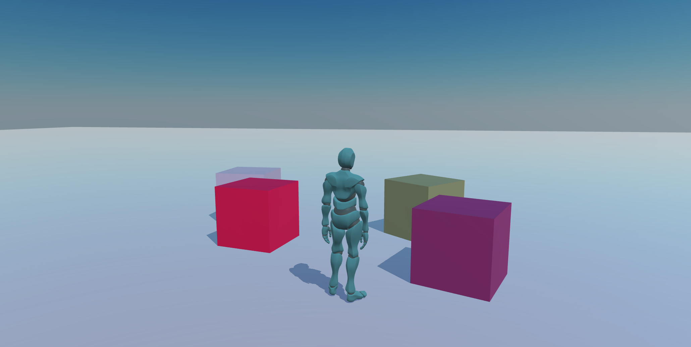

# OpenWorlds



OpenWorlds is a Babylon.js + TypeScript third-person action RPG prototype.  
It includes real-time combat, enemy archetypes, NPC interactions, dialogue, and a quest loop in a single hub scene.

## Features

- Third-person player controller with camera-relative movement and optional pointer lock (click the game canvas; Esc to release)
- Action combat with:
  - 3-hit melee combo
  - Dodge roll
  - Dash Strike ability
  - Spin Slash ability
  - Target cycling
- Enemy AI archetypes (melee chaser, heavy bruiser, ranged caster)
- NPC interaction and dialogue system
- Quest state + objective tracking HUD

## Controls

- `W A S D` — Move
- `Mouse` — Camera look
- `J` or `Left Click` — Attack
- `Space` — Dodge
- `E` — Dash Strike
- `Q` — Spin Slash
- `F` or `Tab` — Cycle target
- `T` — Interact / talk
- `Enter` / `Space` / `T` — Advance dialogue
- `P` — Screenshot
- `V` — Toggle physics debug viewer
- `H` — Toggle controls help overlay
- `Esc` — Release mouse after pointer lock (click canvas again to recapture)
- `R` — Quick reset (reload)

## Getting Started

```bash
npm install
```

### Development

```bash
npm run serve
```

### Build

```bash
npm run build:dev
npm run build
```

### Lint & Format

```bash
npm run lint:check
npm run lint:fix
npm run format
```

## Related Babylon.js RPGs

If you want another take on browser action RPGs in Babylon.js, [**hdevx/3D-Action-RPG-JavaScript**](https://github.com/hdevx/3D-Action-RPG-JavaScript) is worth a look: vanilla JavaScript (no bundler), a **scene manager** for switching levels, terrain and animation examples, and an **in-game level builder**. You can [play the hosted demo](https://www.rpgskilltreegenerator.com/RPG/index.html?scene=outdoor) and switch scenes with query params such as [`?scene=inn`](https://www.rpgskilltreegenerator.com/RPG/index.html?scene=inn), [`?scene=outdoor`](https://www.rpgskilltreegenerator.com/RPG/index.html?scene=outdoor), or [`?scene=builder`](https://www.rpgskilltreegenerator.com/RPG/index.html?scene=builder). Append [`&debug=true`](https://www.rpgskilltreegenerator.com/RPG/index.html?scene=outdoor&debug=true) to open a scene inspector.

## Tech Stack

- Babylon.js + Havok physics
- TypeScript
- Webpack
- ESLint + Prettier
